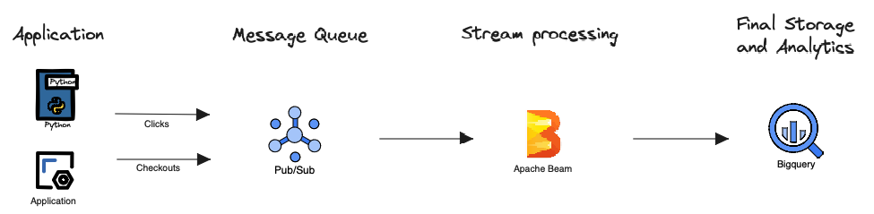

# First click stream processing

This project is a streaming data pipeline to process first click attribution for e-commerce checkout. Its goal is it to identify, real time, for every product purchased, the click that led to this purchase. There are multiple tipes of [attributions](https://www.shopify.com/blog/marketing-attribution#3) on e-commerce business.

This project is inspired on [this post](https://www.startdataengineering.com/post/data-engineering-project-for-beginners-stream-edition/) and recreated using different stack.

Processing pipeline is created using apache beam with python SDK and executed on a docker container.

## Architecture

This project consists of:
- data_gen python script, which generate fake data for users, clicks and checkouts. This replaces applications on a production environment, which will be generating the actions executed by users;
- Google Pub/Sub topics, which receive events for clicks and checkouts as messages to be processed;
- Redis cluster to store data from users to be used as enrichment on attribution pipeline
- Apache beam streaming / real-time pipeline that reads messages from clicks and checkout Pub / Sub, enrich with information from users, makes attribution of first click to checkout and stores it on Google Bigquery
- Google Bigquery table to store final data




Above architecture is generated with help from five docker containers orchestrated with docker-compose:
- redis: redis cluster
- datagen: runs script to generate fake data
- create_bq_table: creates Bigquery table for final storage
- create_pubsub: creates PubSub topics and subscriptions for clicks and checkout
- streaming: runs streaming pipeline to process messages

---

## Ownership
**Developer:** @jefersonmsantos

## Usage

1. Create a project on GCP console
2. Create a service-account on this project, with the following permissions:
    - Pub/Sub Admin
    - Bigquery Data Editor
    - Bigquery Job User

3. Generate a json key for this service account, and save it inside folders:
    - streaming
    - create_bigquery_table
    - create_pubsub
    - data_gen

4. Execute command:
```
docker-compose up -d
```